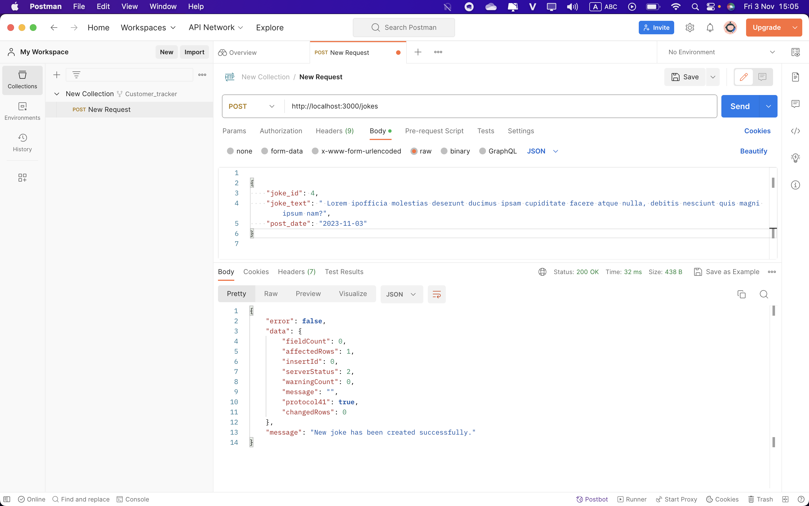
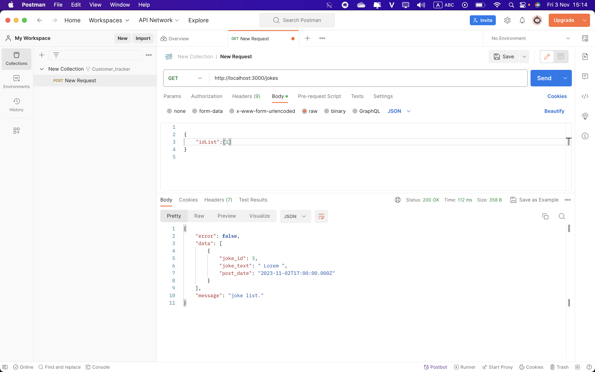
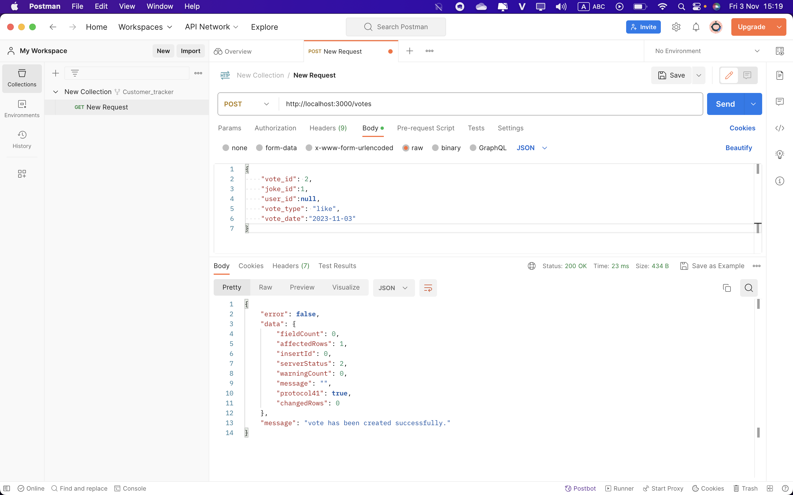

## Setup

## Step 1

Npm i at backend folder

## Step 2

Create 'zens' database in mysql

## Step 3

Change db password in server.js file(line 15)

## Step 4

run "node server.js"

## Step 5 create user, joke, vote table

http://localhost:3000/create-table-user
http://localhost:3000/create-table-joke
http://localhost:3000/create-table-vote

## Step 6 Insert Joke data

POST: http://localhost:3000/jokes

## Step 7 Get a joke random

GET: http://localhost:3000/jokes

Can get all jokes by remove idList in Boby

## Step 8 Voting Joke

POST: http://localhost:3000/votes

